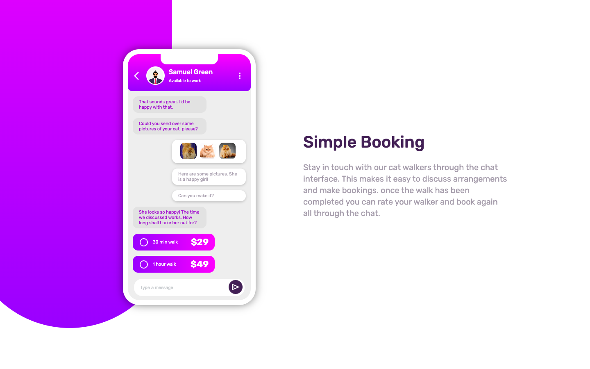

# Frontend Mentor - Chat app CSS illustration solution

This is a solution to the [Chat app CSS illustration challenge on Frontend Mentor](https://www.frontendmentor.io/challenges/chat-app-css-illustration-O5auMkFqY). Frontend Mentor challenges help you improve your coding skills by building realistic projects. 

## Table of contents

- [Overview](#overview)
  - [Screenshot](#screenshot)
  - [Links](#links)
- [My process](#my-process)
  - [Built with](#built-with)
  - [What I learned](#what-i-learned)
  - [Continued development](#continued-development)
- [Author](#author)


## Overview

### Screenshot



### Links

- Solution URL: [Add solution URL here](https://your-solution-url.com)
- Live Site URL: [Add live site URL here](https://your-live-site-url.com)

## My process

### Built with

- VS Code
- CSS custom properties
- CSS Grid


### What I learned

It helped me to learn:

- to make the background design using shapes.
- to allign elements(right or left) randomly on a particular section

To see how you can add code snippets, see below:

```html
<h1>Some HTML code I'm proud of</h1>
```
```css
.background-design{
    background: linear-gradient(to top, hsl(264, 100%, 61%), hsl(293, 100%, 63%));
}
```


### Continued development

- further i would like to learn how to apply JAVASCRIPT and make it responsible to animate and else


## Author

- Website - [Kartik Kumar](https://www.your-site.com)
- Frontend Mentor - [@kartikhullannavar25-hub](https://www.frontendmentor.io/profile/kartikhullannavar25-hub)


